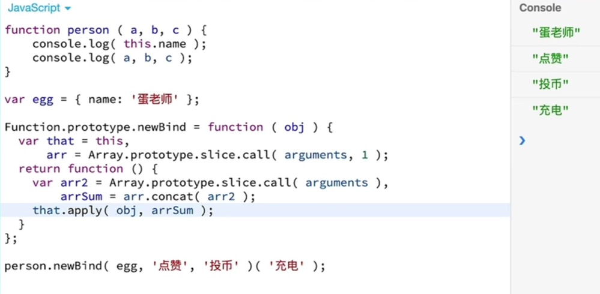
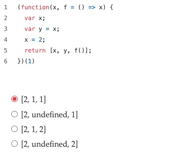
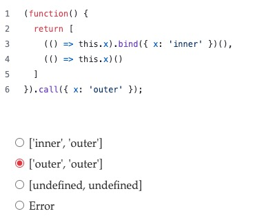
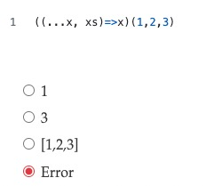
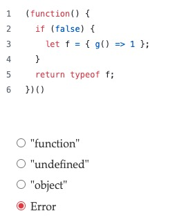

## 1. 什么是闭包？闭包的形成条件是什么？

闭包是指能够访问其他函数作用域中变量的函数，即使那个外部函数已经执行完毕。

形成条件: 内部函数使用了外部函数的局部变量

使用场景：

- 函数作为返回值: 

```js
function createCounter() {
  let count = 0; // 外部函数变量
  
  // 内部函数（闭包）
  return function() {
    return ++count; // 引用外部变量
  };
}

const counter = createCounter();
console.log(counter()); // 1
console.log(counter()); // 2
```

- 函数作为参数传递

```js
function outer() {
  const secret = "123"; // 外部变量
  
  // 将内部函数作为参数传递
  setTimeout(function inner() {
    console.log(secret); // 引用外部变量
  }, 1000);
}

outer(); // 1秒后输出"123"
```

- 立即执行函数(IIFE)创建闭包

```js
const module = (function() {
  const privateVar = "私有数据";
  
  return {
    getVar: function() { // 闭包方法
      return privateVar; // 引用外部变量
    }
  };
})();

console.log(module.getVar()); // "私有数据"
```

闭包的作用：

- 创建私有变量
- 函数缓存与状态持久化
- 模块化封装
- 函数柯里化


## 2. substring vs slice 什么区别？
## 3. function vs 箭头函数 什么区别？
## 4. 函数柯里化： 实现函数add(1)(2)(3)(4)=10

参考：
```js
function add(a){
 function s(b){
    a = a+b;
    return s;
 } 
 s.toString = function(){return a;}
 return s;
}

console.log(+(add(1)(2)(3)(4)+''))
```

抽象封装：

```js
function curry(fn) {
  const originArgs = 
  return function curried(...args) {
    if (args.length >= arity) {
      return fn.apply(this, args);
    } else {
      // curriedSum(1,2,3,4,5)的情况
      return function(...moreArgs) {
        return curried.apply(this, args.concat(moreArgs));
      };
    }
  };
}

function sum(a, b, c, d) {
  return a+b+c+d;
}

const curriedSum = curry(sum); // curried
console.log(curriedSum(1)(2)(3)(4)); // 10
console.log(curriedSum(1, 2)(3)(4)); // 10
```

## 5. 实现防抖节流函数

参考：

```js
function debounce(func, delay) {
  let timer;
　// 通过闭包使timer一直存在内存中
  return function (...args) {
    clearTimeout(timer);    
    timer = setTimeout(() => {
        func.apply(this, args); //通过apply还原this指向事件
    }, delay)
  }
}
```

## 6. this

```js
// 1
const obj = {
  name: 'Alice',
  greet: function() {
    console.log(this.name);
  }
};
const func = obj.greet;
func(); // 输出什么？

// 2
function Person(name) {
  this.name = name;
  console.log(this); // 输出什么？
}
const person1 = new Person('Bob');

// 3 
const obj = {
  name: 'SHa',
  sayHi1: () => {
    console.log(this.name)
  },
  sayHi2() {
    console.log(this.name)
  },
}
obj.sayHi1()  // '' 打印的是 window.name
obj.sayHi2()  // SHa


```

## 7. 实现bind/call/apply

参考：
```js
// 这个方法，传入的对象会多一个属性p，还有更好的处理方式吗？比如 symbol？
Function.prototype.newCall = function(o) {
  let obj = o || window;
  
  obj.p = this; // 这里的 this 指向调用 newCall的你要改变this指向的函数，使用 obj 对象属性过渡一下，就是要把调用的this指向obj
  let newArgs = [];
  for(let i = 1; i < arguments.length; i++) {
    newArgs.push(arguments[i]);
  }

  return obj.p(...newArgs);
}

// 或者
Function.prototype.newCall = function(context, ...args) {
  // 使用bind创建新函数并立即调用
  return this.bind(context)(...args);
};

// 使用 func.newCall(obj, 1,2,3)
```



## 8. 构造函数与普通函数有什么区别？

- 构造函数：用于创建和初始化对象，通过 new 关键字调用，this 指向新创建的对象，返回新对象。
- 普通函数：用于执行特定的任务或计算，直接调用，this 的值取决于调用方式，返回函数体中的 return 值。

## 9. 实现一个 copy功能 的函数缓存

```js
function copyText(text) {
  if (navigator.clipboard) {
    copyText = text => {
      navigator.clipboard.writeText(text)
    }
  } else {
    copyText = text => {
      const textarea = document.createElement('textarea');
      textarea.value = text;
      document.body.appendChild(textarea);
      textarea.select();
      
      try {
        document.execCommand('copy');
        return Promise.resolve();
      } catch (err) {
        return Promise.reject(err);
      } finally {
        document.body.removeChild(textarea);
      }
    }
  }
}
```

## 10. 下面输出什么

```js
// 1
function getItems(a, ...args, b) {
  return [...a, ...args, b]
}

getItems([123,456], 789, 'abc') // 报错， args必须是最后一个

// 2
(function(){
  return typeof arguments;
})();

// 3
var f = function g(){ return 23; };
typeof g();

// 4
(function(x){
  delete x;
  return x;
})(1);

// 5
var y = 1, x = y = typeof x;
x;

// 6
(function f(f){
  return typeof f();
})(function(){ return 1; });

// 7
var foo = {
  bar: function() { return this.baz; },
  baz: 1
};
(function(){
  return typeof arguments[0]();
})(foo.bar);

// 8
var foo = {
  bar: function(){ return this.baz; },
  baz: 1
}
typeof (f = foo.bar)();

// 9
var f = (function f(){ return "1"; }, function g(){ return 2; })();
typeof f;

// 10
var x = 1;
if (function f(){}) {
  x += typeof f;
}
x;

// 11
var x = [typeof x, typeof y][1];
typeof typeof x;

// 12
(function(foo){
  return typeof foo.bar;
})({ foo: { bar: 1 } });

// 13
(function f(){
  function f(){ return 1; }
  return f();
  function f(){ return 2; }
})();

// 14
with (function(x, undefined){}) length;
```

## 11. 闭包传参与变量赋值


## 12. 箭头函数测试





## 13. 生成器函数

- Generator.prototype.next() 方法的参数有什么作用？如何通过 next() 方法向暂停的生成器函数内部传递数据？
- 如何在生成器函数内部处理错误？try...catch 块如何与 yield 配合工作？
- 打印输出

```js
function* gen1() {
  yield 1;
  yield 2;
}

function* gen2() {
  yield 3;
  yield* gen1(); // 使用 yield*
  yield 4;
}

const it = gen2();
console.log(it.next()); // { value: 3, done: false }
console.log(it.next()); // { value: 1, done: false }
console.log(it.next()); // { value: 2, done: false }
console.log(it.next()); // { value: 4, done: false }
console.log(it.next()); // { value: undefined, done: true }
```

## 14. 地域回调

回调函数是一种常见的编程模式，用于在某个操作完成后执行特定的代码。回调地狱（Callback Hell）：当多个异步操作嵌套时，代码可能会变得难以阅读和维护。

解决回调地狱的方法
- Promise：Promise 是一种用于处理异步操作的对象，可以避免回调地狱。
- async/await：async/await 是基于 Promise 的语法糖，使异步代码看起来更像同步代码，提高了代码的可读性。
