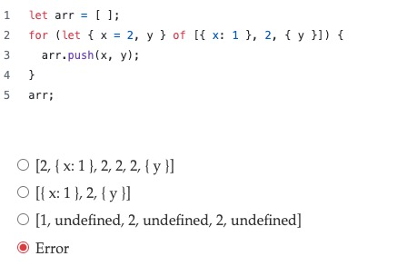

## 1. 请说明 if...else if...else 结构和 switch...case 语句各自的适用场景和优缺点。
## 2. 解释三元运算符 (condition ? expr1 : expr2) 的作用? 他和 if 有什么区别？
## 3. 在遍历大型数组时，for 循环和 forEach 方法在性能上有什么差异？什么时候选择哪种方式更优？请从底层机制角度进行简要说明。
## 4. 如何终止一个循环？有不能终止的循环吗？
## 5. 看图写输出



## 6. 下面代码输出什么

```js
for (var i = 0; i < 10; i++) {
  setTimeout(function() {
    console.log(i);  // 输出十个10，而不是0-9
  }, 0);
}
```
> 如何改进？说出三种方式

方案1：使用 IIFE（立即调用函数表达式）创建闭包
```javascript
for (var i = 0; i < 10; i++) {
  (function(j) {
    setTimeout(function() {
      console.log(j);  // 输出0-9
    }, 0);
  })(i);
}
```

方案2：使用 let 块级作用域（ES6+推荐）

```javascript
for (let i = 0; i < 10; i++) {
  setTimeout(function() {
    console.log(i);  // 输出0-9
  }, 0);
}
```

方案3：利用 setTimeout 的第三个参数

```javascript
for (var i = 0; i < 10; i++) {
  setTimeout(function(j) {
    console.log(j);  // 输出0-9
  }, 0, i);
}
```

方案4：使用 bind 函数

```javascript
for (var i = 0; i < 10; i++) {
  setTimeout(function(j) {
    console.log(j);  // 输出0-9
  }.bind(null, i), 0);
}
```

