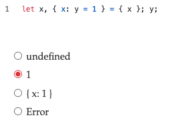
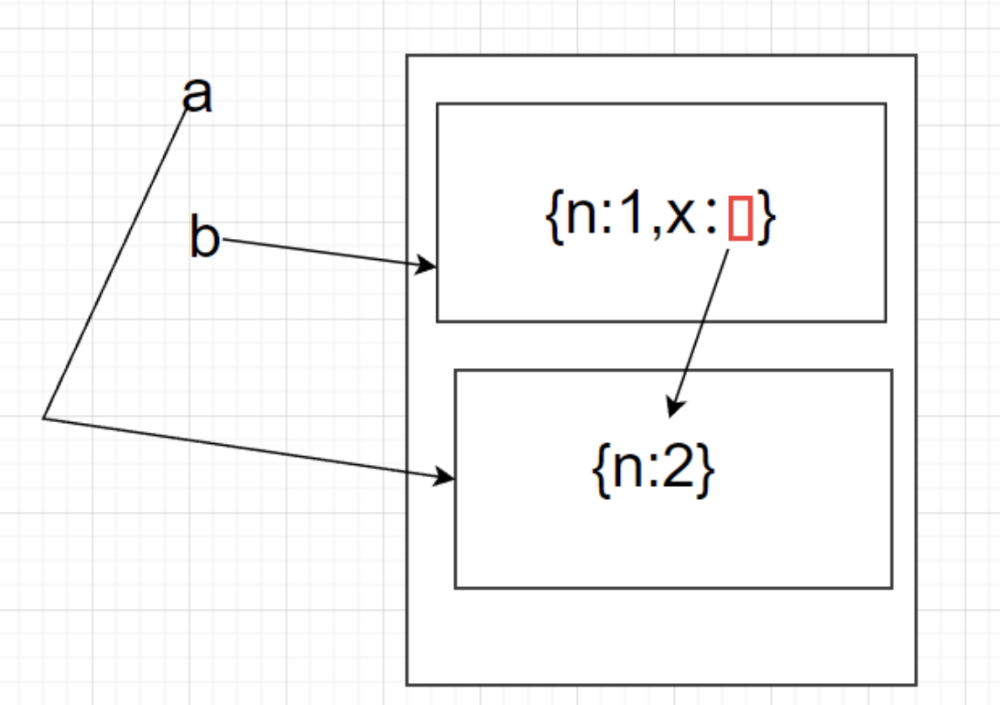

## 1. 千分位转换

**题目：**
```js
const str = '10000000000'; // 千分位转换
```

**方法1：正则的前瞻运算**
```js
str.replace(/\B(?=(\d{3})+$)/g, ',')
```
> \B 表示在非边界地区判断

**方法2：Intl.NumberFormat**
```js
Intl.NumberFormat('en-US').format(100000000)
```

---

## 2. 让下面代码成立

**题目：**
```js
var [a,b] = {a: 1, b: 2}
```
让对象可迭代

**解法：**
```js
Object.prototype[Symbol.iterator] = function() {
    return Object.values(this)[Symbol.iterator]()
}
```

---

## 3. 打印什么

**题目：**
```js
const a = { abc: 1, 1: 'hello', 9: 3, 2: {} }
console.log(Object.keys(a))
```
> [1, 2, 9, 'abc']
---

## 4. 数字字面量

**题目：**

下面的字面量声明会输出什么：

- 01
- 1
- .1
- 010 八进制
- 08 不合法八进制当做10进制
- 0o8 报错
- 0xabc 十六进制
- 0b001 二进制
- 1e10 科学计数法

---

## 5. undefined 和 void 0的区别

**1. 安全性差异**
```js
// 非严格模式下可能被篡改
var undefined = 123;
console.log(undefined); // 123 (危险！)

// void 0 永远安全
console.log(void 0); // undefined (始终可靠)
```

**2. 严格模式下的行为**
```js
"use strict";
undefined = 456; // 抛出TypeError

// void 0 仍然安全
console.log(void 0); // undefined
```

**3. 性能表现**
- void 0 是运算符，直接返回undefined
- 访问undefined 需要查找全局属性（略微更慢）

---

## 6. 让下面返回 true

**题目：**
```js
var a = ?;
console.log(a == 1 && a== 2 && a == 3)
```

**解答：**
```js
var a = {
    n:1,
    valueOf: function() {
      return this.n++
    }
}
```

---

## 7. 解构赋值



---

## 8. 使用 with 切换作用域

```js
var qs = location.search.substring(1);
var hostName = location.hostname;
var url = location.href;
// -->
with (location){
    var qs = search.substring(1);
    var hostName = hostname;
    var url = href;
}
```

---

## 9. with改变作用域

```js
var obj = {
    x: 10,
    foo: function () {
        with (this) {
            var x = 20;
            var y = 30;
            console.log(y);//30
        }
    }
};
obj.foo();
console.log(obj.x);//20
console.log(obj.y);//undefined
```

---

## 10. this 变量

**（1）输出什么**
```js
({
x: 10,
foo: function () {
    function bar() {
        console.log(x);
        console.log(y);
        console.log(this.x);
    }
    with (this) {
        var x = 20;
        var y = 30;
        bar.call(this);
    }
}
}).foo();
```

**（2）输出什么**
```js
function example() {
  console.log(x);
  var x = 10;
  let y = 20;
  const z = 30;

  console.log(this);
  
  function innerFunction() {
    console.log(this);
    const arrowFunction = () => {
      console.log(this);
    };
    arrowFunction();
  }

  innerFunction();
}

example();
```

---

## 11. 判断变量类型有哪些方式

- 基本数据类型 typeof / isNaN() / Number.isNaN / isFinite / Number.isFinite / isInteger / Number.isInteger / Number.isSafeInteger 
- 数组：
    1. arr instanceof Array
    2. arr.constructor === Array
    3. Array.isArray(arr)
    4. Array.prototype.isPrototypeOf(arr)
    5. Object.getPrototypeOf(arr) === Array.prototype
    6. Object.prototype.toString.call(arr) === '[object Array]'
- 对象
    1. Object.prototype.toString.call(val) === '[Object Object]'; // true为对象
    2. val.constructor === Object;
    3. Object.getPrototypeOf(val) === Object.prototype;
- 特定类的实例
    1. p instanceof Person
    2. p.__proto__ === P.prototype
    3. p.constructor === P
- 空对象
    1. JSON.stringify(data) === '{}'
    2. Object.getOwnPropertyNames(obj).length
    3. Object.keys(obj).length
    4.
    ```js
    function isObjectEmpty (obj) {
      for (let key in obj) {
        if(obj.hasOwnProperty(key)) return false
      }
      return true
    }
    ```

---

## 12. delete 的使用限制

```js
function foo(){}
foo = 1;

delete foo; // false
typeof foo; // "number"
  
this.bar = 1;

delete bar; // true

typeof bar; // "undefined"
typeof this.a; // "undefined"

delete 2; // true
```
---

## 13. 命名空间与变量引用问题

```js
let a = {n: 1};
let b = a;
a.x = a = {n: 2};  // 表达式执行过程中，a的指向变了，但是表达式没有执行完毕，a.x的a还是原来的地址 （从左往右解析引用，从右往左赋值）
console.log(a.x);//undefined
console.log(a);
console.log(b);//{n:1,x:{n:2}}
console.log(a === b.x);//true
```
a.x 确实被改了，但是改的是b，新的a已经赋值成了{n: 2}



## 14. 变量隐式转换

下面输出什么：

```js
console.log(1 + '2');
console.log('1' + 2);
console.log('1' + '2');
console.log(1 + true);
console.log('10' - 5);
console.log('5' * '2');
console.log(null + 1);
console.log(undefined + 1);
console.log([] + {});
console.log({} + []);

console.log(null == undefined);
console.log(null === undefined);
console.log(0 == false);
console.log('' == false);
console.log('0' == false);
console.log([] == 0);
console.log([] == ![]);
console.log({} == {});
console.log(NaN == NaN);
console.log([] == ![]);
console.log('1' == true);

console.log(!!'hello');
console.log(!!0);
console.log(!![]);
console.log(!!{});
console.log(!!'');
console.log(!!null);
console.log(!!undefined);
console.log(!!NaN);

console.log(1 && 'hello');
console.log(0 || 'world');
console.log(null && 100);
console.log(NaN || []);

const obj = {
  valueOf() { return 1; },
  toString() { return 'hello'; }
};
console.log(obj + 1);
console.log(obj - 1);
console.log(String(obj));
console.log(Number(obj));
```


## 15. 值传递与引用传递

输出什么：

```js
function increment(num) {
  num++;
}

let count = 10;
increment(count);
console.log(count); // 输出什么？
```

如果想通过函数修改外部原始值, 要怎么做?

```js
function realIncrement(num) {
  return num + 1;
}
count = realIncrement(count);
console.log(count);
```

## 16. Symbol

输出什么：

```js
const s1 = Symbol();
const s2 = Symbol();
const s3 = Symbol('description');
const s4 = Symbol('description');

console.log(s1 === s2);
console.log(s3 === s4);
console.log(typeof s3);
```

## 17. 手写一个深拷贝 (90% 完备)

```js
function deepClone(obj, hash = new WeakMap()) {
  // 1. 处理原始类型（包括 null 和 undefined）
  if (obj === null || (typeof obj !== 'object' && typeof obj !== 'function')) {
    return obj;
  }

  // 2. 处理 Date 类型 （如果不拦截，会被拷贝为一个普通{}，下同）
  if (obj instanceof Date) {
    return new Date(obj);
  }

  // 3. 处理 RegExp 类型
  if (obj instanceof RegExp) {
    return new RegExp(obj);
  }

  // 类似的还有 Set/Map/Symbol等
  if (typeof obj === 'function') {
    return obj.bind({}); // 克隆函数初级
  }

  // 4. 处理循环引用
  // 如果当前对象已经被拷贝过，直接返回之前拷贝的实例
  if (hash.has(obj)) {
    return hash.get(obj);
  }

  // 5. 创建新对象或新数组（根据传入对象的类型）
  const cloneObj = Array.isArray(obj) ? [] : {};

  // 6. 存储当前对象和其拷贝的映射关系，以应对循环引用
  hash.set(obj, cloneObj);

  // 7. 递归拷贝所有属性
  for (const key in obj) {
    // 确保只处理对象自身的属性，而不是原型链上的属性
    if (Object.prototype.hasOwnProperty.call(obj, key)) {
      cloneObj[key] = deepClone(obj[key], hash);
    }
  }

  return cloneObj;
}
```

> JSON.stringify 序列化会干掉 function、Symbol、Date、正则等类型的属性值

克隆函数进阶：

```js
function cloneFunction(func) {
  // 获取函数体和参数
  const body = func.toString();
  
  // 处理箭头函数和普通函数
  if (body.startsWith('function') || body.startsWith('(')) {
    // 通过new Function重建函数
    return new Function('return ' + body)();
  }
  
  // 无法处理的函数类型
  return func;
}

// 在deepClone中添加：
if (typeof obj === 'function') {
  return cloneFunction(obj);
}
```