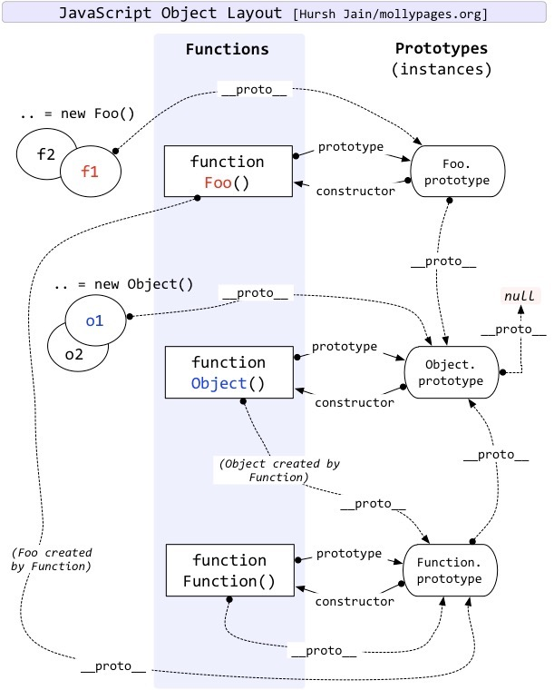

## 1. 实现 `Promise.all`（需处理错误边界）

```js
function promiseAll(promises) {
  return new Promise((resolve, reject) => {
    // 如果输入不是数组，可以转换为数组或直接reject
    if (!Array.isArray(promises)) {
      return reject(new TypeError('Argument must be an array'));
    }

    const results = [];
    let completedCount = 0;
    const totalPromises = promises.length;

    // 处理空数组情况
    if (totalPromises === 0) {
      return resolve(results);
    }

    promises.forEach((promise, index) => {
      // 确保处理的是Promise对象（处理非Promise值）
      Promise.resolve(promise)
        .then((value) => {
          results[index] = value;
          completedCount++;
        
          // 当所有Promise都完成时，resolve结果
          if (completedCount === totalPromises) {
            resolve(results);
          }
        })
        .catch(reject); // 任何一个Promise reject，整体就reject
    });
  });
}
```

## 2. 实现 `Promise.race`（需处理错误边界）

```js
function promiseRace(promises) {
  return new Promise((resolve, reject) => {
    // 参数验证
    if (!Array.isArray(promises)) {
      return reject(new TypeError('Argument must be an array'));
    }

    // 处理空数组情况（根据规范，空数组会永久挂起）
    if (promises.length === 0) {
      return; // 不调用resolve或reject，Promise将永远pending
    }

    promises.forEach(promise => {
      // 确保处理的是Promise对象（处理非Promise值）
      Promise.resolve(promise)
        .then(resolve) // 第一个resolve触发外层resolve
        .catch(reject); // 第一个reject触发外层reject
    });
  });
}
```

## 3. 实现 `Promise.any`（需处理错误边界）

```js
function promiseAny(promises) {
  return new Promise((resolve, reject) => {
    // 参数验证
    if (!Array.isArray(promises)) {
      return reject(new TypeError('Argument must be an array'));
    }

    // 处理空数组情况
    if (promises.length === 0) {
      return reject(new AggregateError([], 'All promises were rejected'));
    }

    const errors = [];
    let rejectedCount = 0;

    promises.forEach((promise, index) => {
      Promise.resolve(promise)
        .then(resolve) // 任何一个resolve就立即解决外层Promise
        .catch(error => {
          errors[index] = error;
          rejectedCount++;
        
          // 当所有Promise都被拒绝时
          if (rejectedCount === promises.length) {
            reject(new AggregateError(
              errors, 
              'All promises were rejected'
            ));
          }
        });
    });
  });
}
```

## 3.1 实现bind/call/apply

参考：

```js
Function.prototype.myCall = function (ctx, ...args) {
  ctx = ctx == null ? globalThis : Object(ctx);   // null/undefined -> 全局对象
  const key = Symbol('fn');
  ctx[key] = this;                                // 把函数挂到目标对象上
  const res = ctx[key](...args);                  // 执行
  delete ctx[key];
  return res;
};

Function.prototype.myBind = function (context) {
  // 判断调用对象是否为函数
  if (typeof this !== 'function') {
    throw new TypeError('Bind must be called on a function');
  }
  // 获取参数
  const args = [...arguments].slice(1),
        fn = this;
  return function Fn() {
    // instanceof 来过滤 new bind出来的函数，因为new出来的，this必须指向自己。
    // args 是接收 bind 时传进来的预设参数，在实际调用时，预设的补充参数会拼接在调用传参之前。
    return fn.apply(this instanceof Fn ? this : context, args.concat(...arguments));
  };
};
```

## 4. 防抖（`debounce`）与节流（`throttle`）的实现及适用场景

> 监听 input 事件，使用 AbortController 也可以实现防抖

```js
// 1. debounce: 表单输入和验证场景、resize、点击动作 等只关注最终状态的场景
input.addEventListener('input', () => {
  controller.abort();
  setTimeout(() => {
    // 执行操作
  }, 500);
}, { signal: controller.signal });
```

```js
// 2. debounce
function debounce(func, delay) {
  let timer = null;
  
  return function(...args) {
    const context = this;
  
    // 清除之前的定时器
    if (timer) clearTimeout(timer);
  
    // 设置新的定时器
    timer = setTimeout(() => {
      timer = null;
      func.apply(context, args);
    }, delay);
  };
}

// 3. throttle：在一定时间间隔内，函数最多执行一次，适合关注过程状态的场景。滚动事件、鼠标移动等
// 增强版可以加入尾调用、首次立即执行等
function throttle(func, delay) {
  let timer = null;
  let lastTime = 0;
  
  return function(...args) {
    const context = this;
    const now = Date.now();
    const remaining = delay - (now - lastTime);

    if (remaining <= 0) {
      if (timer) {
        clearTimeout(timer);
        timer = null;
      }
    
      lastTime = now;
      func.apply(context, args);
    } else {
      // 增强：设置定时器，确保最后一次尾调用执行
      timer = setTimeout(() => {
        lastTime = Date.now();
        func.apply(context, args);
      }, remaining);
    }
  };
}
```

## 5. 原型链关系图

原型的概念借鉴了 Self 语言



## 6. 组合寄生继承

```js
function  SubType(){
  //继承自SuperType
  SuperType.call(this);
}
SubType.prototype = Object.create(SuperType.prototype); // 改进的原型链，更灵活，避免共享实例属性问题
SubType.prototype.constructor = SubType; 
```

## 7. 深拷贝

```js
function deepClone(target, map = new WeakMap()) {
  // 处理原始类型
  if (target === null || typeof target !== 'object') {
    return target;
  }

  // 处理特殊对象类型
  if (target instanceof Date) return new Date(target);
  if (target instanceof RegExp) return new RegExp(target);
  if (target instanceof Map) return new Map(Array.from(target.entries()));
  if (target instanceof Set) return new Set(Array.from(target.values()));

  // 检查循环引用
  if (map.has(target)) {
    return map.get(target);
  }

  // 初始化克隆对象
  const proto = Object.getPrototypeOf(target);
  const cloneObj = Object.create(proto);
  // 缓存当前对象，防止循环引用
  map.set(target, cloneObj);

  // 克隆Symbol属性
  const symKeys = Object.getOwnPropertySymbols(target);
  for (const symKey of symKeys) {
    clone[symKey] = deepClone(target[symKey], map);
  }

  // 克隆常规属性
  for (const key in target) {
    if (Object.prototype.hasOwnProperty.call(target, key)) {
      clone[key] = deepClone(target[key], map);
    }
  }

  return clone;
}
```

## 8. Event loop

消息循环


浏览器渲染


reflow


repaint


## 8.1. 重排（Reflow）与重绘（Repaint）的优化策略

重排：

- 添加/删除可见DOM元素
- 元素位置、尺寸变化（包括边距、填充、边框等）
- 内容变化（如文本改变或图片大小改变）
- 页面渲染初始化
- 浏览器窗口尺寸改变
- 读取某些属性（如offsetTop、scrollHeight等）

> 优化：批量dom操作和样式classList使用、文档片段等

重绘

- 颜色、背景色、透明度等样式变化
- 边框样式变化
- 阴影变化
- visibility变化（但不影响布局）

> 优化：使用transform和opacity、will-change、避免在循环里读取-写入样式、使用精准的css选择器 div > span
> will-change 提前告知浏览器元素可能发生的变化。用于即将发生的复杂动画或交互。常用于 transform、opacity或scroll-position。会增加GPU内存占用，不要使用 all 等。

## 9. Proxy 和 Reflect

Proxy 是 ES6 引入的用于创建对象代理的构造函数，可以拦截并自定义对象的基本操作（如属性查找、赋值、枚举等）。

Reflect 是 ES6 提供的操作对象的 API，它提供了一组与 Proxy handlers 对应的方法，用于更优雅地操作对象。

**Reflect 设计目的**：

- 将 Object 的一些明显属于语言内部的方法（如 `Object.defineProperty`）转移到 Reflect 上
- 修改某些 Object 方法的返回结果（如 `Object.defineProperty` 失败时返回 false 而不是抛出错误）
- 让 Object 操作都变成函数行为

常用：

```js
// receiver 参数：receiver 是 Reflect.get 和 Reflect.set 方法中的一个关键参数，它决定了当访问 getter/setter 时的 this 绑定
// 所以他一般跟随 proxy 使用
const proxy = new Proxy(target, {
  get(t, prop, receiver) {
    console.log(`Getting ${prop}`);
    return Reflect.get(t, prop, receiver);
  }
});
```

**题目**：使用 Proxy 实现一个对象，当访问或设置其属性时能打印日志

**解答**：

```javascript
const createTrackableObject = (obj) => {
  return new Proxy(obj, {
    get(target, prop) {
      console.log(`Getting ${prop}`);
      return Reflect.get(target, prop);
    },
    set(target, prop, value) {
      console.log(`Setting ${prop} to ${value}`);
      return Reflect.set(target, prop, value);
    }
  });
};

const obj = createTrackableObject({ a: 1 });
obj.a; // 控制台输出: Getting a
obj.b = 2; // 控制台输出: Setting b to 2
```

**题目**：使用 Proxy 使数组支持负索引（如 `arr[-1]` 访问最后一个元素）

**解答**：

```javascript
const createNegativeArray = (arr) => {
  return new Proxy(arr, {
    get(target, prop) {
      const index = parseInt(prop);
      if (index < 0) {
        prop = target.length + index;
      }
      return Reflect.get(target, prop);
    }
  });
};

const arr = createNegativeArray([1, 2, 3]);
console.log(arr[-1]); // 3
console.log(arr[-2]); // 2
```

**问题**：为什么 Proxy 的 handler 方法通常与 Reflect 方法配合使用？

**答案**：

1. **保持默认行为**：Reflect 提供了与 Proxy traps 对应的原始对象操作
2. **避免重复实现**：直接调用 Reflect 方法比手动实现默认行为更可靠
3. **一致性**：Reflect 方法的参数与 Proxy traps 完全匹配
4. **返回值处理**：Reflect 方法返回布尔值表示操作是否成功，便于 Proxy 处理

**性能考虑**：

- Proxy 会带来一定的性能开销
- 不适合在性能关键路径上大量使用
- V8 等现代引擎已对 Proxy 做了优化

**无法拦截的操作**：

- 严格相等比较（`===`），因为比的是内存地址
- `Object.keys()` 等操作只能部分拦截，Proxy 可以拦截 Object.keys() 的调用本身。但无法拦截引擎内部获取属性名的操作

## 10. 性能优化

目的是在有限的网络资源的前提下，尽可能快的加载网络数据（js、css、图片等）和 浏览器尽可能快速渲染出页面。
所以优化的方向就是 减少资源包体积、减少网络请求次数、控制页面同屏渲染元素数量、避免反复渲染等

进而提出一些指标 FCP、LCP、FID、CLS 等

网络加载层面：

使用 预链接、预加载、CDN、缓存、localStorage、webpack缓存、service worker，多线程打包、memo缓存函数 等节省网络带宽
使用 webpack 资源拆包、 external、文件压缩、Tree Shaking、js/css压缩 减少每个包的体积

渲染层面：

SSG/SSR、虚拟列表、各种懒加载（图片，组件等）渲染策略，提升用户体验
确定关键元素尺寸、避免布局抖动
避免大的 js 执行阻塞住渲染线程


#### wp5 新功能

- 持久化缓存（Persistent Caching）, 将构建结果（包括模块、loaders 等）缓存到磁盘上

```js
cache: {
    type: 'filesystem', // 启用文件系统缓存
    buildDependencies: {
        // 缓存的 key，当配置文件或 package.json 发生变化时，缓存会失效
        config: [__filename]
    }
}
```

- 新插件引入
  HashedModuleIdsPlugin和NamedChunksPlugin
- 改进树摇，把没用到的代码删得更干净、删得更早、删得更快。sideEffects 告诉 Webpack“哪些文件/模块有副作用（不能删）”，其余的全部放心 Tree-Shaking。
- 支持 es6
- 模块邦联技术
- 优化 loader 规则，比如 type: 'asset' 的增加
- 改进代码分割
- 提供更好用的默认配置

#### 如何通过 webpack 优化构前端性能

先分析：

- webpack-bundle-analyzer
- rollup-plugin-visualizer

收集 FCP、LCP、FID、CLS

措施：

- 1. js 压缩
     optimization中使用 terser-webpack-plugin 进行多线程压缩、mode 传 production 开启默认压缩
- 2. css
     css-minimizer-webpack-plugin
- 3. html 压缩
     html-webpack-plugin
- 4. gzip
     compression-webpack-plugin
- 5. 图片压缩
     image-webpack-loader
- 6. Tree Shaking
     usedExports: true/ sideEffects: false
     css处理：purgecss-plugin-webpack
- 7. splitChunks、externals
     分离第三方库、使用 cdn 抽离

#### 如何优化构建速度

- 1. 换打包工具，比如 rspack
- 2. webpack 持久化和缓存使用
- 3. DllPlugin和DllReferencePlugin
- 4. 各个插件的多线程选型 (也可用插件 webpack-parallel-uglify-plugin)
- 5. 减少文件搜索范围

```js
resolve: {
  modules: ['node_modules'],
  extensions: ['.js', '.jsx', '.json'],
},
```

- 6. 缓存 babel 编译结果

#### vite 存在的意义

现在常用的构建工具如Webpack，主要是通过抓取-编译-构建整个应用的代码（也就是常说的打包过程），生成一份编译、优化后能良好兼容各个浏览器的的生产环境代码

webpack 问题

- 项目大时打包缓慢
- dev server HMR （基于 express 的websocket 通信） 慢，有性能瓶颈

vite 为什么会快

主要源于其创新的原生ES模块(ESM)利用和预构建优化架构设计

| 技术点      | Webpack         | Vite                             |
| ----------- | --------------- | -------------------------------- |
| 编译工具    | Babel + Terser  | esbuild（Go语言编写，快10-100x） |
| HMR(热更新) | 全量重建依赖图  | 于ESM的精准边界HMR               |
| TS处理      | 需配置ts-loader | 原生支持.ts文件                  |
| CSS处理     | 需css-loader    | 原生支持import'./style.css'      |
| 启动机制    | 打包后启动      | 直接启动+按需编译                |

#### webpack proxy 作用

使用 http-proxy-middleware，便于在开发模式下请求转发配置，可以解决跨域问题。（直接配 Access-control-allow-* 也可）

#### plugin 和 loader 的区别

- loader 是文件加载器，能够加载资源文件，并对这些文件进行一些处理，诸如编译、压缩等，最终一起打包到指定的文件中。其本质为函数，函数中的 this 作为上下文会被 webpack 填充，因此我们不能将 loader设为一个箭头函数\n 函数接受一个参数，为 webpack 传递给 loader 的文件源内容\n 函数中 this 是由 webpack 提供的对象，能够获取当前 loader 所需要的各种信息。函数中有异步操作或同步操作，异步操作通过 this.callback 返回，返回值要求为 string 或者 Buffer'
- plugin 赋予了 webpack 各种灵活的功能，例如打包优化、资源管理、环境变量注入等，目的是解决 loader 无法实现的其他任务。webpack 是基于 tapable 开发的，插件采用发布订阅模式，在注册时的特定生命周期内执行。模板：

```js
class MyPlugin {
  // Webpack 会调用 MyPlugin 实例的 apply 方法给插件实例传入 compiler 对象
  apply (compiler) {
    // 找到合适的事件钩子，实现自己的插件功能
    compiler.hooks.emit.tap('MyPlugin', compilation => {
      // compilation: 当前打包构建流程的上下文
      console.log(compilation);
      // do something...
    })
  }
}
```

#### 各个打包工具对比

| 工具              | 核心优势                    | 主要劣势                        | 最佳适用场景                 |
| ----------------- | --------------------------- | ------------------------------- | ---------------------------- |
| **Webpack** | 生态成熟、高度可配置        | 构建慢、配置复杂                | 大型企业级应用、复杂定制需求 |
| **Rspack**  | 极速构建、兼容 Webpack      | 生态较新、缓存支持弱            | 超大型项目、高性能需求       |
| **Gulp**    | 轻量任务自动化              | 无模块化支持                    | 静态资源处理、自动化任务     |
| **Rollup**  | 极致 Tree Shaking、纯净输出 | 资源处理弱、增量构建缺失        | JavaScript 库/组件开发       |
| **Vite**    | 极速开发、开箱即用          | 生态依赖 Rollup、旧浏览器支持差 | 现代框架开发、中小型项目     |

#### script标签 defer 和 async 的区别

#### CICD的概念

```
提高团队效率的手段。
CI: 持续集成；代码自动构架、测试、代码分析等
CD: 持续交付；自动根据CI反馈情况部署项目、发送到灰度系统等。减少人工干预，降低人为风险
```

#### 如果页面有几百个函数要处理，如何优化性能

- 作为异步函数，setTimeout 或 requestAnimationFrame 分散在各个时间片执行（时分复用）
- 分批处理，划分优先级处理（比如fiber，用户交互、动画等优先级高，ajax、微循环优先级次之）
- 函数本身优化效率
- web worker
- 依靠任务调度库处理（acync.js）

#### SSG 与 SSR

SSG: 静态网站生成。通常将静态网页部署 CDN，提升用户体验。
构建时，提前将展示数据通过API获取，生成静态页面。适合交互少的门户网站和广告页。

SSR：可以提升 SEO 效果和 FCP，但是对于 FID 帮助不大，首次可交互也要等到水合完成才行（可以 dynamic imports + suspense 改善）

#### babel 原理

babel 的转译过程分为三个阶段，这三步具体是：

- 解析 Parse: 将代码解析生成抽象语法树( 即AST )，即词法分析与语法分析的过程
- 转换 Transform: 对于 AST 进行变换一系列的操作，babel 接受得到 AST 并通过 babel-traverse 对其进行遍历，在此过程中进行添加、更新及移除等操作
- 生成 Generate: 将变换后的 AST 再转换为 JS 代码, 使用到的模块是 babel-generator'

#### 如何量化首屏性能（LCP、FID、CLS）

FCP

- PerformanceObserver --> entry.name === 'first-contentful-paint' --> entry.startTime

LCP

- PerformanceObserver 或第三方库 web-vitals --> lastEntry.renderTime || lastEntry.loadTime --> LCP
  优化关键资源加载（CSS、JS、字体）
  使用预加载（`<link rel="preload">`）
  消除渲染阻塞资源
  优化服务器响应时间（TTFB）

FID

- entry.processingStart - entry.startTime
  减少主线程工作（分解长任务）
  优化JavaScript执行（代码分割、懒加载）
  最小化第三方脚本影响
  使用 Web Worker 处理复杂计算

累计布局偏移 CLS

- !entry.hadRecentInput 时累加 entry.value;
  为图片和视频设置尺寸属性（width/height）
  避免在现有内容上方插入动态内容
  使用 transform 动画代替影响布局的属性
  预加载重要资源

> 如何做预加载、预链接：
> preload：
> 不执行资源，只是提前缓存，优先级高
> 必须指定 as 属性（style/script/font/image等）
> 字体文件需要加 crossorigin 属性

prefetch：
空闲时加载后续可能需要的资源（优先级较低

preconnect：
提前建立TCP连接、TLS协商（比dns-prefetch更全面）
用于提前加载字体、CDN、链接API服务器、或者广告分析服务等。
可以和 preload配合使用

> navigator.sendBeacon('/analytics', analyticsData); 资源上报<64kb, 不延迟页面加载

#### 长列表渲染优化（虚拟滚动、IntersectionObserver）

- 懒加载（more）
- IntersectionObserver + div 站位
- 前后数据截断式站位
- CSS-content-visibility

最好的办法是分页+虚拟列表，从产品形态上规避这种情况。

#### 如何设计前端埋点系统？（数据上报策略、降级方案）

```
┌─────────────┐    ┌─────────────┐    ┌─────────────┐
│  数据采集层   │───▶│  数据处理层   │───▶│  数据存储层   │
└─────────────┘    └─────────────┘    └─────────────┘
       ▲                    │                    │
       │                    ▼                    ▼
┌─────────────┐    ┌─────────────┐    ┌─────────────┐
│   客户端      │    │  实时计算    │    │  离线分析    │
└─────────────┘    └─────────────┘    └─────────────┘
```

关键行为：navigator.sendBeacon
批量高频操作：batchQueue=[]; 定时通过fetch往后台推送队列消息
也可以采样上报（随机抽样、分类抽样等）

降级方案：

- 优先使用sendBeacon
- 次选fetch + keepalive
- 最差情况使用Image打点

IndexedDB >  localStorage > memoryStore=[]

网络状态上报：
navigator.connection --> rtt 往返延时

> navigator 属性 clipboard，languages等

#### `requestAnimationFrame` vs. `setTimeout` 在动画渲染中的区别

| 特性     | requestAnimationFrame                      | setTimeout                             |
| -------- | ------------------------------------------ | -------------------------------------- |
| 设计初衷 | 专为动画渲染优化                           | 通用的延迟执行机制                     |
| 调用时机 | 在下一次浏览器重绘前执行                   | 在指定延迟时间后执行（不考虑渲染周期） |
| 执行频率 | 与屏幕刷新率同步（通常60fps，约16.7ms/帧） | 严格按设定时间间隔执行                 |
| 自动暂停 | 页面隐藏时自动停止（节省资源）             | 持续执行（即使页面不可见）             |
| 回调参数 | 提供高精度时间戳（performance.now()）      | 无时间戳参数                           |

> document.documentElement.animate 怎么用  startViewTransition.ready.then + ::view-transition-old(root)

requestAnimationFrame 的回调有两个特点：

- 在重新渲染前调用。
- 回调合并执行。

> 渲染优先级高的：动画绘制、用户输入、微任务

```js
// requestAnimationFrame 在渲染任务执行之前执行
setTimeout(() => {
  console.log(1)
  requestAnimationFrame(() => console.log(2))
})
setTimeout(() => {
  console.log(3)
  requestAnimationFrame(() => console.log(4))
})

queueMicrotask(() => console.log(5))
queueMicrotask(() => console.log(6))

/** 输出
5
6
1
3
2
4
*/
```

#### performance

Performance API 提供高精度的时间测量和性能指标获取能力
performance.getEntriesByType 获取对应指标，比如 paint
performance.now() 微秒级精度，单调递增（不受系统时间调整影响），返回一个从页面导航开始计算的时间戳（单位毫秒）

#### 图片加载策略

`WebP` 自适应 (或渐进式jpg) + 懒加载 + 本地 `localStorage` 缓存 （base64）

#### 如何通过 `Sentry` 实现前端错误的全链路追踪？

- window.onerror 全局监听： Sentry.captureException(error || message);
- unhandledrejection 事件

重写 fetch：

```js
const originalFetch = window.fetch;
window.fetch = async function(...args) {
  const transaction = Sentry.startTransaction({ name: `fetch ${args[0]}` });
  try {
    const response = await originalFetch.apply(this, args);
    transaction.finish();
    return response;
  } catch (err) {
    Sentry.captureException(err);
    transaction.finish();
    throw err;
  }
};
```

- Console 方法劫持
- 获取客户端信息
```

navigator.userAgent（设备/浏览器信息）
window.location（当前 URL）
document.referrer（来源页面）
```

#### 如何避免全局状态管理的性能问题？（Redux 优化策略）

1. 返回不可变引用使用浅比较

```js
import { shallowEqual } from 'react-redux';
```

2. 使用 React.memo 或 PureComponent
3. 拆分 Store 为更小的 Slice
4. 在优化 Redux 性能时，我们首先通过 Reselect 缓存派生数据，避免重复计算；其次用 Immer 简化不可变更新，减少深拷贝开销；最后通过动态注入 Reducer 实现按需加载。对于高频 Action，会结合防抖和节流控制触发频率。


## 11. HTTP/2 多路复用与头部压缩（HPACK）

二进制分帧层，将消息分解为独立的帧（Frame），每个请求/响应对应一个流（ID唯一）

场景	HTTP/1.1	HTTP/2
100个小型资源	6连接×16请求=96	1连接×100请求
延迟时间	高（RTT×连接数）	低（1-2个RTT）
TCP连接利用率	20-30%	90%+

---
HPACK： HTTP/1.x 中，头部字段信息比较多，多次请求或响应重复携带，导致不必要的带宽浪费和延迟增加。
预制一个静态索引表，直接发送索引编号
还有一个动态表，存储一下最近一次发送的头部
特殊情况字面值编码（霍夫曼编码：根据出现的频率构造霍夫曼树）


## 19. HTTPS 握手过程（TLS 1.3 优化点） 


## 20. HTTP 长连接、SSE 与 WebSocket 对比

| 特性                | HTTP 长连接          | SSE                  | WebSocket            |
|---------------------|---------------------|----------------------|----------------------|
| **通信方向**         | 客户端→服务器        | 服务器→客户端        | 全双工通信               |
| **协议基础**         | HTTP                | HTTP                 | 独立协议             |
| **连接建立**         | HTTP 握手           | HTTP 握手            | HTTP 升级握手        |
| **数据格式**         | 任意 HTTP 格式      | `text/event-stream`  | 二进制/文本          |
| **头部开销**         | 每次请求都有头部    | 首次连接后无头部     | 握手后无头部         |
| **自动重连**         | 不支持              | 支持                 | 需手动实现           |
| **浏览器支持**       | 所有浏览器          | 除 IE 外的主流浏览器 | IE10+ 和现代浏览器   |
| **服务器推送**       | 不支持              | 支持                 | 支持                 |
| **适用场景**         | 资源加载/API调用    | 服务器通知           | 实时交互应用         |

## TCP 三次握手

1. 第一次握手（SYN）

客户端 → 服务器：发送 SYN=1（同步标志位）和随机初始序列号 seq=x。

目的：告知服务器“我想建立连接，我的初始序号是 x”。

2. 第二次握手（SYN + ACK）

服务器 → 客户端：回复 SYN=1 + ACK=1（确认标志位），携带自己的初始序列号 seq=y，并确认客户端的序号 ack=x+1。

目的：表示“我收到你的 SYN 了，同意建立连接，我的初始序号是 y，下次请发 x+1”。

3. 第三次握手（ACK）

客户端 → 服务器：发送 ACK=1，序号 seq=x+1，确认号 ack=y+1。

目的：确认服务器的 SYN，告知“我收到你的 SYN 了，接下来从 y+1 开始发数据”。


## 浏览器访问网站都经历什么过程

## 21. 高并发降级策略

关闭一些非核心功能，释放资源给核心功能（可以配置或代码判断）
数据降级：减少数据的复杂度或精度，以降低处理成本。
服务降级：备用接口和数据缓存
依赖服务熔断机制：超过阈值直接熔断（Hystrix）
边缘计算: CDN 等更靠近用户终端的服务

## 11. 跨浏览器兼容性

浏览器兼容性问题是指不同浏览器（如Chrome、Safari、Firefox、Edge）或不同版本对HTML、CSS、JavaScript的解析和渲染不一致，导致页面显示或功能异常。

检测：

- Modernizr库
- caniuse

处理：

- PostCSS
- pollyfill
- css reset库
- css 归一化库 （不同浏览器默认样式不同）

问题

- CSS变量（Custom Properties）如何兼容旧浏览器？（提供回退值，或通过PostCSS转换为静态值）
- 强制使用 webkit 内核（`<meta name="renderer" content="webkit">`）
- 渐进增强（Progressive Enhancement）和优雅降级（Graceful Degradation）的区别？
- 多浏览器自动化测试：工具：Selenium、Playwright、云平台
- CDN资源被广告拦截插件拦截如何处理？

```html
切换CDN域名或使用本地资源。
添加资源完整性校验（SRI）：

<script src="https://cdn.example.com/lib.js" integrity="sha384-..."></script>
```

- 最新趋势：提及Interop 2025对兼容性的改进

> antv x6 的 foreignObject 的 safari 下兼容

- `<foreignObject>` 内的 HTML 内容（如 `<div>`）会被错误地渲染到 SVG 的左上角 (0,0)，而非其定义的位置
- transform/opacity/position
- className 丢失

测试：

- 跨平台测试（覆盖主流浏览器和移动端），IE hack、

#### 如何设置相对单位布局

- 1. 先重置初始css（normalize.css）
- 2. 再设置相对单位布局 （em/rem/%等）
- 3. 弹性布局 + 媒体查询
- 4. 渐进增强 + 优雅降级
- 5. css 前缀处理

## 12. 写代码 & 算法

#### 1. 手写二叉树遍历

层次遍历：

```js
function traverse(node) {
	if (!node) { 
		return;

	}

	const queue = [];
	queue.unshift(node);

	while(queue.length > 0) {
		const printNode = queue.pop();
		console.log(printNode.name)
		if(printNode.children && printNode.children.length > 0) {
			queue.unshift(...(printNode.children.reverse()));
		}
	}
}
```

先序：

```js
function traverse(node) {
	if (!node) return;

	// 前序遍历
	const track = [];
	track.push(node);

	while (track.length > 0) {
		const node = track.pop();
		console.log(node.name);
		const children = node.children;
		if (children && children.length > 0) {
			track.push(...children.reverse());
		}
	}
}
```

后序:

```js
function traverse(node) {
	if (!node) return;

	// 后序遍历(先序遍历的逆向)
	const track = [];
	const quene = [];
	track.push(node);

	while (track.length > 0) {
		const node = track.pop();
		quene.push(node.name);
		const children = node.children;
		if (children && children.length > 0) {
			track.push(...children);
		}
	}

	return quene.reverse();
}
```

中序：

```js
function traverse(node) {
	if (!node) return;

	// 中序遍历
	const stack = [];
	let currentNode = node;
	while (currentNode || (stack.length > 0)) {
		if (currentNode) {
			stack.push(currentNode);
			currentNode = (currentNode && currentNode.children) ? currentNode.children[0] : null;
		} else {
			const poped = stack.pop();
			console.log(poped.name);
			currentNode = poped.children ? poped.children[1] : null;
		}
	}

}
```

#### 2. 重复单词统计

```js
var arr = ["apple","orange","apple","orange","pear","orange"];
function getWordCnt(){
    //以下应掏空
    return arr.reduce(function(prev,next,index,arr){
        prev[next] = (prev[next] + 1) || 1; //这句是重点,刚开始都是undefined的时候undefined+1会是NaN
        return prev;
    },{});
}
```

#### 3. 前端开发流程

https://juejin.cn/post/7085257325165936648

#### 4.  让下面代码成立

```js
var [a,b] = {a: 1, b: 2}
// 让对象可迭代
// 但是不保证顺序
Object.prototype[Symbol.iterator] = function() {
    return Object.values(this)[Symbol.iterator]()
}
```

#### 5. 手写快速排序（递归与非递归实现）  

```js
function quicksort(arr) {
   if(arr.length < 2){
        return arr
    }else{
        let pivot = arr[0];
        let less = arr.slice(1).filter(function(value,index){
            return value <= pivot;
        })
        let greater = arr.slice(1).filter(function(value,index){
            return value > pivot;
        })

        return [...quicksort(less), pivot, ...quicksort(greater)]; 
    }
}
```

```js
function partition(arr, low, high) {
  const pivot = arr[high]; // 选择最后一个元素作为基准
  let i = low; // i是小于基准的元素的边界

  for (let j = low; j < high; j++) {
    if (arr[j] < pivot) {
      [arr[i], arr[j]] = [arr[j], arr[i]]; // 交换元素
      i++;
    }
  }
  
  [arr[i], arr[high]] = [arr[high], arr[i]]; // 将基准放到正确位置
  return i; // 返回基准索引
}

function quickSortIterativeOpt(arr) {
  const stack = [];
  let low = 0;
  let high = arr.length - 1;
  
  stack.push(low);
  stack.push(high);

  while (stack.length > 0) {
    high = stack.pop();
    low = stack.pop();
  
    const pivotIndex = partition(arr, low, high);
  
    // 先处理较小的子数组，减少栈深度
    if (pivotIndex - low < high - pivotIndex) {
      if (pivotIndex + 1 < high) {
        stack.push(pivotIndex + 1);
        stack.push(high);
      }
      if (low < pivotIndex - 1) {
        stack.push(low);
        stack.push(pivotIndex - 1);
      }
    } else {
      if (low < pivotIndex - 1) {
        stack.push(low);
        stack.push(pivotIndex - 1);
      }
      if (pivotIndex + 1 < high) {
        stack.push(pivotIndex + 1);
        stack.push(high);
      }
    }
  }
  return arr;
}
```

## 13. 安全

#### 如何防止 Cookie 被 XSS 窃取？列举至少 3 种防御方案。

- HttpOnly 属性（禁止 JS 读取 Cookie）
- CSP（内容安全策略）限制脚本执行
- 输入过滤/输出编码（如 Vue/React 的自动转义、xss 输入转义白名单）

#### XSS 注入方式

url 参数、输入框输入

#### CSRF Token

```
- 服务器在渲染页面时，把一个随机且与用户会话绑定的 CSRF Token 塞进表单或头信息。
- 用户真正提交时，必须把这个 Token 再带回来。
- 服务器校验：
Token 不存在 → 直接拒绝。
Token 与用户会话不匹配 → 拒绝。

第三方网站拿不到这个 Token，因此伪造的请求会被挡掉。
```

#### 为什么 SameSite Cookie 不能完全替代 CSRF Token？如何设计双重防护？

```
// 双重防护方案：  
1. SameSite=Strict + CSRF Token（加密后存入 Session）  
2. 关键操作要求二次验证（如短信验证码）  
3. 敏感接口限制为 POST/PUT/DELETE  
```

#### 如何检测 npm 包中的恶意代码？

```js
# 检测工具链  
npm audit --production  
npx socket-security analyze  
git hooks 预检查 package.json 变更  
```

#### localStorage 存储 JWT 有何风险？更好的方案是什么？

```js
// 最佳实践：  
1. 敏感 Token 存内存（Vuex/Pinia）  
2. 短期 Token 存 HttpOnly Cookie  
3. 配合短期 Refresh Token 轮换  
```

#### 防点击劫持

X-Frame-Options 响应头 'DENY'

## 14. css

#### BFC

```
常见开启条件
	float 不为 none
	position 为 absolute 或 fixed
	display: inline-block
	display: flow-root
	overflow 不为 visible
	contain: layout
	Flex / Grid 容器

特性
	隔离元素样式
	阻止外边距折叠
	包含浮动元素，阻止父元素高度塌陷
	阻止与浮动元素重叠覆盖
```

## 15. 架构与微前端

#### 对比

以下是国内主流微前端框架在关键实现技术上的对比表格，综合了各框架的技术文档和实际应用案例：

| 框架               | 实现原理                                                                                      | JS沙箱策略                                                                               | CSS隔离方案                                                                                                 | 主子应用通信方式                                                  | 路由拦截处理                                         | 静态资源路径处理                                  |
| ------------------ | --------------------------------------------------------------------------------------------- | ---------------------------------------------------------------------------------------- | ----------------------------------------------------------------------------------------------------------- | ----------------------------------------------------------------- | ---------------------------------------------------- | ------------------------------------------------- |
| **Qiankun**  | 基于 single-spa 的 `import-html-entry`解析子应用HTML，动态加载JS/CSS，通过Proxy重构全局环境 | 1.**Proxy沙箱**（默认）：拦截全局对象操作`<br>`2. **快照沙箱**（兼容IE11） | 1.**ShadowDOM**（严格隔离）`<br>`2. **Scoped CSS**（实验性）`<br>`3. **手动命名空间** | `initGlobalState`全局状态管理，支持一级属性变更监听和跨应用同步 | 主应用路由劫持，子应用独立路由，需手动协调跳转逻辑   | 需配置子应用 `publicPath`为绝对地址，避免404    |
| **EMP**      | 基于Webpack 5 Module Federation，实现模块级共享和运行时集成                                   | 依赖Webpack的闭包隔离，无额外沙箱                                                        | 依赖构建工具CSS Modules或手动命名空间                                                                       | 通过共享模块直接调用，或自定义EventBus                            | 依赖主应用路由控制，子应用无感知                     | Webpack自动处理资源路径，无需特殊配置             |
| **MicroApp** | 使用WebComponent的 `<micro-app>`标签封装子应用，底层优化iframe通信                          | `with`语句+闭包隔离，性能开销较低                                                      | **ShadowDOM**强制隔离，部分UI库需适配                                                                 | 自定义事件系统（`dispatchEvent`/`addEventListener`）          | 主应用统一路由拦截，子应用路由变化通过事件通知       | 自动重写子应用资源路径为绝对地址                  |
| **Wujie**    | 基于优化版iframe，通过DOM代理将子应用渲染到主文档                                             | **iframe原生隔离**，通过 `postMessage`通信                                       | **iframe原生隔离**，支持样式穿透控制                                                                  | `props`属性传递 + `window.$wujie`全局方法调用                 | 主应用统一控制iframe URL，子应用路由变化通过事件同步 | iframe自动处理资源路径，无404问题                 |
| **Garfish**  | 路由劫持+动态加载子应用资源，支持SSR集成                                                      | Proxy沙箱（类似qiankun） + 快照恢复                                                      | 1.**动态样式表卸载**`<br>`2. **手动命名空间**                                                 | 1.`Garfish.channel`事件总线`<br>`2. 共享Redux/Vuex            | 主应用路由劫持，支持子应用路由拦截联动               | 运行时动态修正资源路径，支持CDN地址重定向         |
| **Icestark** | 动态加载子应用JS/CSS，通过生命周期钩子控制渲染                                                | 无严格沙箱，依赖代码规范                                                                 | **CSS Scoped**（自动添加前缀）                                                                        | `icestark`全局状态管理API                                       | 主应用路由匹配激活规则，子应用独立路由               | 需手动配置子应用 `publicPath`或使用插件自动处理 |

#### 关键差异说明：

1. **沙箱强度**：Wujie的iframe原生隔离安全性最高，但性能开销大；Qiankun/Garfish的Proxy沙箱平衡了性能与隔离性。
2. **CSS隔离**：ShadowDOM方案（MicroApp）隔离彻底但兼容性差，Scoped CSS（Qiankun/Icestark）更灵活。
3. **通信效率**：EMP的模块共享和MicroApp的事件系统延迟最低（2-3ms），Wujie的iframe通信延迟较高（7-8ms）。
4. **资源处理**：iframe方案（Wujie）无路径问题，其他框架需绝对路径或运行时修正。

> 完整技术细节可参考各框架官方文档及示例代码。

- `Module Federation` 在微前端中的应用
- **React/Vue 深度问题**
  - Vue3 的响应式原理（`Proxy` vs. Vue2 的 `defineProperty`）
  - React Hooks 的实现机制（`useEffect` 依赖数组的作用）
  - 如何设计一个高阶组件（HOC）？
- - `qiankun` 微前端方案的实现原理
  - 

沙箱隔离的实现方案（Proxy vs. Shadow DOM）及样式冲突解决策略

- 如何设计基于 `pnpm workspace` 的多项目依赖共享方案？
- 如何解决 `Monorepo` 下不同子项目的版本冲突？

   “把巨石前端拆小、把异构系统拼整、让团队独立演进”*


#### MicroApp 源码浅析


#### Monorepo 与 微前端优缺点对比

### **Monorepo 与 微前端优劣势对比表格**

| **维度**         | **Monorepo** | **微前端** |
|------------------|-------------|------------|
| **代码复用**      | ✅ **高**（直接引用共享模块） | ⚠️ **中**（需通过模块联邦或 npm 包共享） |
| **依赖管理**      | ✅ **统一版本**（避免冲突） | ⚠️ **独立管理**（可能版本不一致） |
| **技术栈灵活性**  | ❌ **受限**（需统一工具链） | ✅ **自由**（支持多框架共存） |
| **构建性能**      | ⚠️ **依赖优化工具**（如 Turborepo） | ✅ **独立构建**（按需加载） |
| **团队协作**      | ✅ **透明高效**（代码集中） | ✅ **自治开发**（团队隔离） |
| **部署独立性**    | ❌ **全量发布**（需协调） | ✅ **增量更新**（子应用独立） |
| **性能开销**      | ✅ **低**（无运行时隔离） | ⚠️ **较高**（沙箱/通信成本） |
| **适用规模**      | ✅ **大型项目**（百人团队） | ✅ **复杂系统**（多团队协作） |
| **学习成本**      | ⚠️ **中高**（需掌握工具链） | ⚠️ **中高**（需处理隔离/通信） |
